Rapport TP1

Cours 1

SAKSIK Melvyn \| 08/09/22

# Exercice 2

**Manuel**

1.  La commande Which sert à localiser un fichier dont le nom correspond
    à l'argument donné.

    

2.  Il suffit d'entrer « / » suivi du terme recherché.

> 

3.  Il suffit d'appuyer sur « q »

4.  Cette section parle des programmes disponibles avec le système
    catégorisé comme des jeux ou drôle.

**Navigation dans l'arborescence des fichiers**

1.  

2.  

3.  

4.  

5.  On nous indique que nous n'avons pas la permission d'y accéder.

6.  On nous indique que la commande « cd » ne peux pas être utilisé
    directement après sudo qui permet une élévation de permission car cd
    est une commande relative au Shell. Ainsi il faudrait l'utiliser
    dans un Shell ayant les privilèges.

7.  

8.  Le Fichier1 peut etre supprimer mais pas le Dossier 1 car celui-ci
    est un dossier.

9.  Il suffit d'utiliser rmdir spécialement conçu pour les dossiers vide
    (ou rm
    --d).
10. On nous indique que ce n'est pas possible car le dossier n'est pas
    vide.
    

11. Pour supprimer un dossier non vide, la commande rmdir ne peux etre
    utiliser car aucune option ne nous permet de le faire. Il faut alors
    uiliser « rm --d » en ajoutant l'option « r ».

**Commandes importantes**

1.  Il s'agit de la commande « date » pour afficher l'heure.

La commande « time » permet de lancer un programme et d'afficher le
resultat de la commande et le temps pris par chaque utilisateur ayant
participé a l'execution de la commande.

2.  Les fichiers commençant par un «. » sont des fichiers cachés.
    

3.  Le fichier ls est situer au chemin suivant :
    

4.  Il n'existe pas de manuel pour cette commande.
    
La commande « ll » est un alias de la commande « ls --alF » qui est plus
longue.

5.  La commande ls /usr/bin permet d'afficher son contenu.
    

6.  D'apres le manuel, ls permet de lister le contenu d'un dossier.

7.  Il s'agit de la commande « pwd ».

8.  La commande crée un fichier plop et écrit dedans bip en écrasant le
    contenu.
    

9.  Elle crée un fichier plop si pas déjà crée. Puis elle rajoute bip à
    son contenu.
    

10. Cette commande afficher « toto » pendant 10 secondes (elle fait
    durer la commande echo 10 secondes).

11. La commande « file » determine le type du fichier en argument.

12. Lors que l'on modifie le contenu du fichier original, le contenu du
    fichier lier changer également.
    

Lorsque le fichier original est supprimer le fichier lier rester et le
contenu est inchanger.

13. Lorsque le fichier lien_phy est modifier la repercution a lieu sur
    le fichier lien_sym.

Lorsque le fichier lien_phy est supprimé, le lien_sym est également
supprimer.

14. Le raccourcie Ctrl + S permet d'arreter le défilement et Ctrl + Q
    permet de le reprendre. (et Ctrl + C permet de stopper l'operation
    de
    défilement.)

15. Pour afficher les 5 premières lignes il suffit d'utiliser head -5
    /var/log/syslog.

Pour afficher les 15 dernières lignes il suffit d'utiliser tail -15
/var/log/syslog.

Pour afficher les lignes entre 10 et 20 il faut utiliser head -20
/var/log/syslog \| tail +10

16. Elle affiche le resulta de la commande dmesg dans l'interface less.
    

17. /etc/passwd contient toutes les informations relatives aux
    utilisateurs. Pour afficher le manuel de ce fichier il suffit faire
    less /etc/passwd.

18. Pour faire cela il faut utiliser la commande sort --dr /etc/passwd
    \| cut --c1

19. La commande wc --l /etc/passwd permet de determiné le nombre
    d'utilisateur ayant un compte sur la machine.

20. Il y en a 141.

21. Il suffit de faire la commande find / -type f --name passwd

22. La commande sera find / -type f --name passwd \>
    \~list_passwd_files.txt 2\> /dev/null

23\. Il suffit de faire grep ll \~/.bashrc

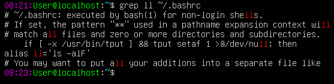

24\. Le fichier history.log se situe dans /var/log/apt/.

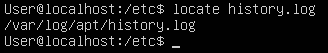

25\. Le fichier n'apparait pas. Cela ne fonctionne pas car Locate
fonctionne avec une base de donnée qui est configurer par défaut pour
ignorer certain dossier dont le dossier personnel.

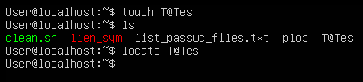

**Découverte de l'éditeur de texte nano**

1.  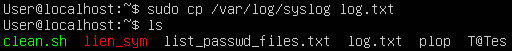

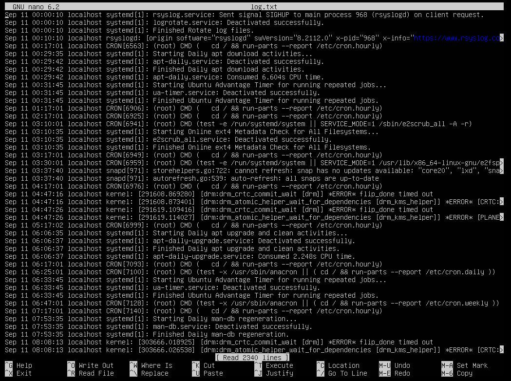

2.  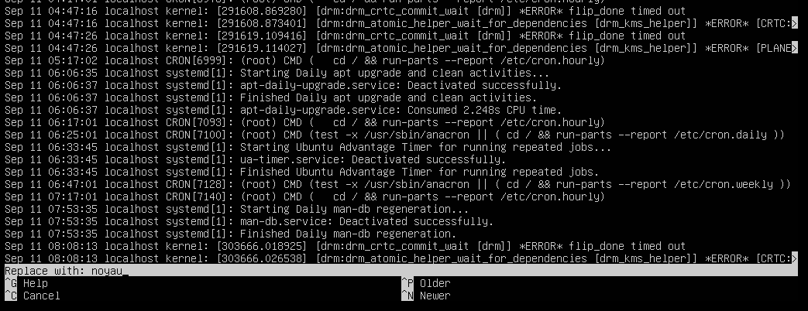

> 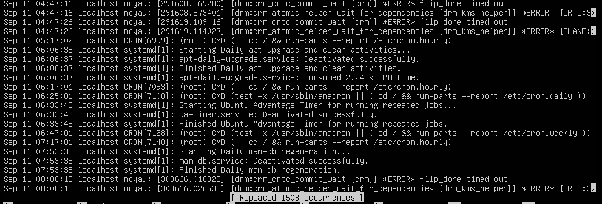
>
> 3.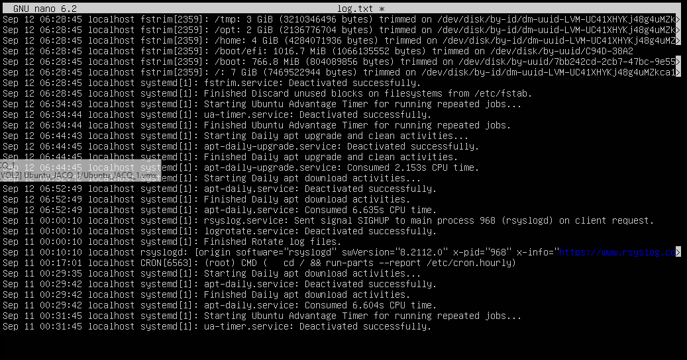

4\.

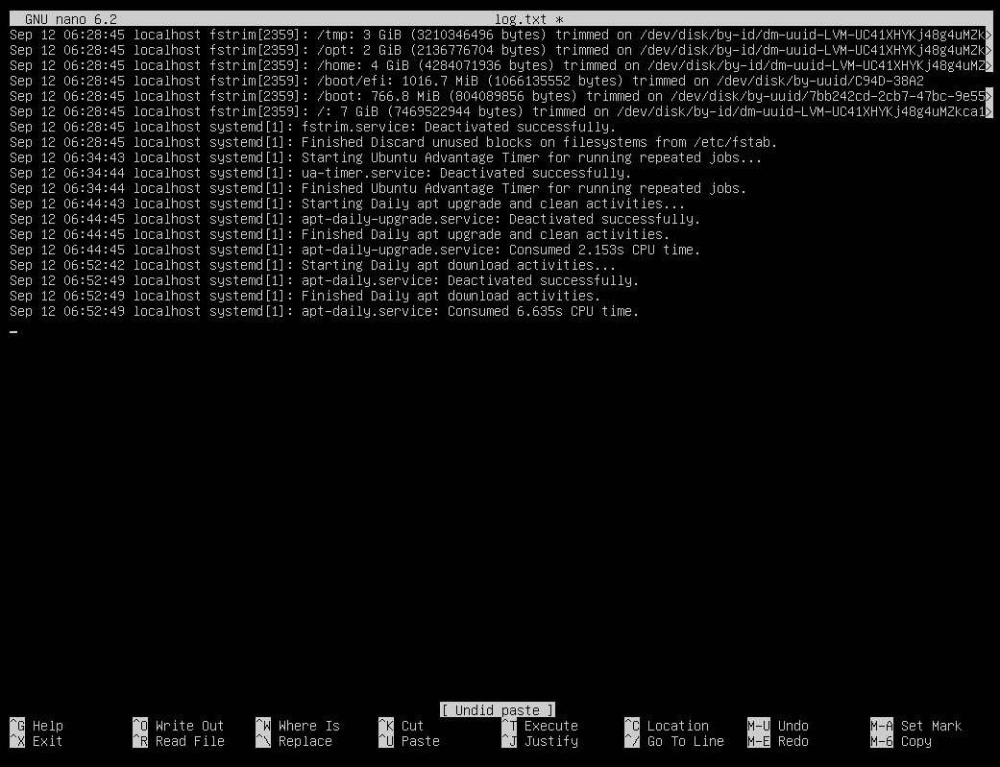

5\.
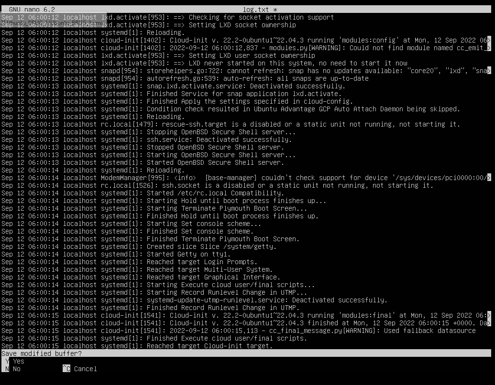

**Personnalisation du shell**

1.  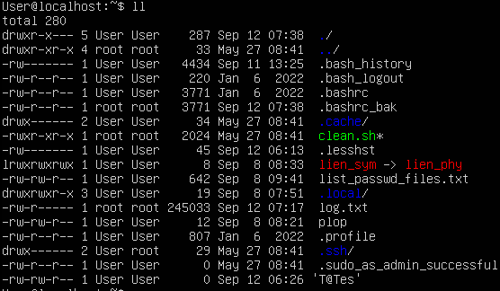

2.  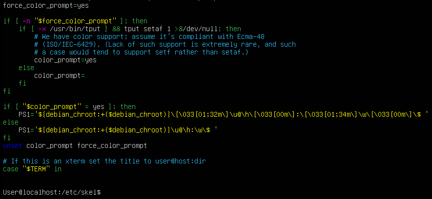

3.  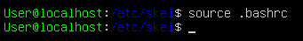

4.  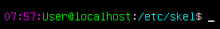
